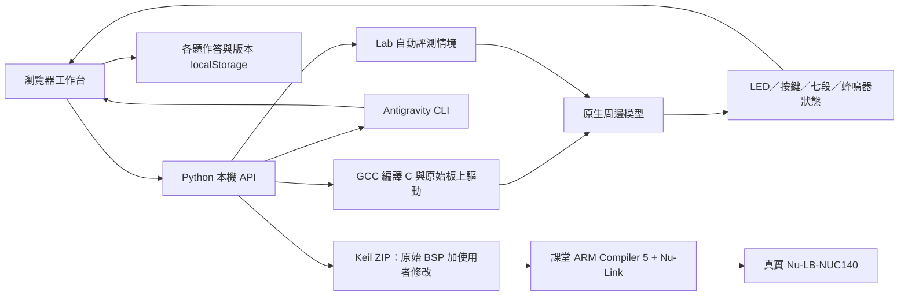

# 系統架構

## 第一版的技術決策

NUC140 並非直接使用通用瀏覽器模擬器就能涵蓋的開發板。第一版選擇編譯學生的 C 和原始板上驅動，再使用課程所需的周邊模型。原始 BSP 是硬體匯出的基準，模擬標頭則獨立存放，因此學生不需要把平台專用介面寫進自己的程式。

## 模組

| 位置 | 責任 |
| --- | --- |
| `web/` | 可縮放四欄工作台、深／淺色主題、程式檔案、板子、版本、聊天 |
| `web/editor.js`、`web/assets/editor/` | Monaco 編輯器、C 縮排／片段、檔案 model、GCC 診斷與離線資源 |
| `web/markdown.js`、`web/assets/mentor/` | Markdown 結構、KaTeX 公式、HTML 清理與離線字型 |
| `web/mentor-resize.js` | 模擬板／導師分隔線、方向鍵、比例保存與收合後復原 |
| `web/assets/problems/` | 原始簡報題目區域截圖，來源與裁切座標另有記錄 |
| `arena/curriculum.py` | 六題資料、教材來源、允許的 Sample Code、可攜設定 |
| `arena/projects.py` | 請求驗證、修改疊加與自包含 Keil ZIP |
| `arena/simulation.py` | GCC 子程序、雙向訊息、診斷、逾時與生命週期 |
| `sim/runtime.c`、`sim/include/` | GPIO 周邊模型和模擬用相容標頭 |
| `arena/grading.py` | 按題目要求操作按鍵、檢查狀態與輸出 |
| `arena/mentor.py` | CLI NDJSON 輸入、成功結果解碼與中文錯誤提示 |
| `server.py` | 本機 HTTP、背景評測／AI 工作、模擬管理 |
| `vendor/bsp/` | 未修改的課堂 BSP 子集與七個範例 |
| `tests/` | 端到端 C／板子／評測／ZIP 驗證和 CLI 協定測試 |

## 編輯器與原題

前端每個 Lab／檔案各有一個 Monaco model，同一次開啟工作台時保留游標、捲動位置與復原紀錄。內容變更會立即同步到原有作答資料，沿用自動儲存、版本、評測與硬體匯出的流程。`lab_config.h` 的 model 與 DOM 輸入欄位都設為唯讀，設定面板仍為唯一修改入口。編譯診斷只標示這次 GCC 回報的位置，修改後會清除過期標記。

`tools/build-editor.mjs` 將固定版本的 Monaco C tokenizer 與編輯功能打包在 repo 中，頁面不需連線 CDN。使用者啟動方式維持 Python 本機服務；修改編輯器整合時才需要 Node 建置。原題圖片由題庫資料中的 `originalSlides` 指定，與整理版題目同時顯示。

## C 的兩條路徑

模擬路徑：`main.c` 與兩個板上驅動使用模擬相容標頭編譯，入口改名為 `arena_user_main`，由 runtime 管理執行。每次 GPIO 存取會同步輸出及輸入，延遲函式推進虛擬時間；runner 每一段輸出帶標記的 JSON，等待下一段按鍵與時間預算。

硬體路徑：匯出將相同的學生程式和驅動疊加回原始 BSP 結構，保留真實 CMSIS、StdDriver、startup、Keil compiler/debug 設定。相對路徑維持課堂範例的目錄深度。各匯出專案都包含自己的 Library，修改驅動不會影響 BSP 基準或另一份專案。

`lab_config.h` 只是一般 C 常數，兩條路徑都能使用。`MCU_init.h` 的使用者修改會帶進匯出，但模擬不會認證該時脈或周邊初始化配置的硬體效果。

## 板子模型

LED PC12–PC15 低電位點亮；七段位選 PC4–PC7 高電位致能。段線依 BSP 接到 PE3=A、PE4=B、PE0=C、PE5=D、PE6=E、PE2=F、PE7=G、PE1=小數點，低電位點亮。模型整合每段在時間窗內的亮燈比例，所以原始 multiplex 掃描程式可以顯示四位數；按鍵切換的第一個時間窗可能包含舊圖形。

鍵盤按鍵 1/4/7、2/5/8、3/6/9 分別連接 PA2、PA1、PA0，列由 PA3–PA5 掃描。`ScanKey` 保留原始 C，讀取這個矩陣；一次按住多鍵不保證無 ghosting。PB11 邊緣和佔空比用於蜂鳴器狀態與頻率。

本模型只實作上述課程所需的子集；GPIO 的輸出模式和 DOUT／PIN 為近似，DMASK、去彈跳、GPIO 中斷等欄位沒有完整硬體效果。沒有逐條 ARM 指令、精準 CPU 週期、中斷或完整 MCU 暫存器模擬。

## API 與生命週期

| 方法 | 路徑 | 功能 |
| --- | --- | --- |
| GET | `/api/labs`、`/api/template` | 題庫與原始範例／骨架 |
| GET | `/api/environment` | GCC、CLI 路徑可用性；不代表登入成功 |
| POST | `/api/simulations` | 編譯、建立 runner |
| POST | `/api/simulations/{id}/step` | 按鍵集合與 1000–100000μs 時間窗 |
| DELETE | `/api/simulations/{id}` | 終止並清理 runner |
| POST | `/api/judge`、`/api/mentor` | 提交背景工作 |
| GET | `/api/jobs/{id}` | 進度、結果或錯誤 |
| POST | `/api/export` | 產生 Keil ZIP |

同時最多四個互動 runner，背景工作使用兩個 worker，最多四項未完成工作。閒置 runner 在下一次 API 請求時檢查十分鐘期限。每個 runner 使用獨立 `.runtime/run-*` 目錄，結束後清理；十二秒無回應會終止，不會將卡住狀態誤判為通過。HTTP 啟用 TCP_NODELAY，避免小型板子訊息被延遲確認拖慢。

服務只綁定 `127.0.0.1`，驗證 Host 與 Origin。原始碼檔名採固定白名單，限制來源大小。這些限制不是原生 C 沙箱；平台是個人本機練習用途。

## AI 導師

回覆由 Marked 解析 Markdown，公式在解析階段交給 KaTeX，最後以 DOMPurify 清理 HTML。公式支援行內與獨立區塊，下標與反斜線不會先被當作 Markdown 改寫；程式碼區塊保持原文。渲染器、字型與授權文件由 `tools/build-mentor.mjs` 打包，使用者不需連線 CDN。渲染測試涵蓋原本未顯示的二進位公式、中文粗體、巢狀清單、表格、程式碼與不可信內容。

右欄的板子與導師共用可拖曳分隔線，上下排列調整高度、左右排列調整寬度，比例分開存入 localStorage。面板收合時暫停套用比例，展開再復原；原本的聊天與模擬流程不受影響。

CLI 採官方 [headless NDJSON 協定](https://www.antigravity.google/docs/cli/headless/)，以 stdin 傳送題目、程式、設定和近期模擬資料，避開 Windows 參數長度限制。每次呼叫使用獨立暫存工作區、plan 模式和 CLI sandbox，保留預設 permission review，不啟用自動略過權限。

導師提示要求只提供分析與教學，不執行命令或修改檔案；程式和輸出被當作待分析資料。只有 terminal `result.status=SUCCESS` 且有回覆時才顯示正常答案；失敗、逾時、登入問題不會拿部分回應冒充完成。AI 結果不參與 Lab 判分。

## 下一階段

1. 在課堂安裝的 Keil ARM Compiler 5 與實體板逐題驗證，校正指示燈方向、時間容忍度和警報聲。
2. 新 Lab 先增加教材資料、測試情境與所需 BSP；增加新周邊前明確建立支援模型。
3. 若需要 ARM 韌體、Timer/NVIC 或暫存器教學，再增加 NUC140 CPU／周邊模擬後端。
4. 若改成多人線上服務，將原生編譯／執行移到隔離 worker，增加帳號與持久資料庫；本機 CLI 改由獨立本機橋接服務提供。
